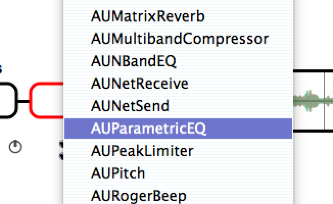

# Scumbler (version 0.4.0)

*January, 2015*

Thanks for beta testing my Scumbler app. 

<i>**Please** don't pass this link along to anyone else yet; I'm trying to make sure that things are relatively stable before letting too many people play with it.</i>

I hope that it's at least fun to poke at; beyond that I'm hoping that it's something that anyone might actually want to use to make music with.

For background, the goal of this project was outlined in a post on my [work blog](http://www.artandlogic.com/blog/2013/02/developing-audio-applications-with-juce-part-1/):

   <blockquote>For decades, I've been a fan of the music of guitarist Robert Fripp. Throughout his career, he's done a series of solo performances (originally referred to as 'Frippertronics', later rechristened 'Soundscapes') that consist of him performing over live loops of his own playing. Originally, he implemented this using a pair of reel-to-reel tape recorders with a single long loop of tape strung between both of them, then transitioning to a rack of digital delays and effects as those tools became available. In 2010, I took my son into Manhattan to hear what Fripp says will be his final Soundscapes performance ever.

   For this project, I decided that it was a reasonably-scoped project to build a pure software system that:

   * Works with professional grade multichannel audio I/O hardware
   * Runs on both Mac OS and Windows (...and eventually iOS, I hope)
   * Can loop multiple independent tracks of audio
   * Can process audio using VST or AU plugins.

   I'm calling this system 'The Scumbler' &mdash; partly because it's a name that I can be safe that no marketing guy is ever going to try to use, and partly because it describes what the program will do very well. "Scumble" is a term from art for covering a painted area with a layer of semi-opaque paint to soften the colors or outlines, and that's a lot like what we'll end up doing.</blockquote>

I'm also very interested in things like:

**Non-Skeumorphic User Interfaces** I've never liked the emphasis in music software on attempting to make photo-realistic versions of existing gear. This isn't like an existing piece of gear, and at this point we can drop the pretense&mdash;people know how to use computers now. The Scumbler isn't a piece of equipment; it's a magic document that works with audio. Anything that doesn't need to be on the screen shouldn't be on the screen. Anything you might want to change while performing should be big enough that you don't need to fiddle with the mouse too much (Google ["Fitt's Law"](https://www.google.com/search?client=safari&rls=en&q=fitt's+law&ie=UTF-8&oe=UTF-8)). 

**Freedom Through Constraints** This isn't a Digital Audio Workstation. It does a specific set of things, and that's all it's supposed to do. I have a long list of features that I want to add to the app (and I welcome more ideas!) but I'll keep fighting the natural impulse to keep adding too much. ProTools, Logic, and Ableton are all over there someplace. You know where to find them.

## The Scumbler

If you're reading this, you probably already downloaded [the app](http://www.tetrakite.com/scumbler/downloads/0.4.x/Scumbler_0.4.0.dmg) from this site and dragged it to your Applications folder.

## Launching the app

Because this isn't a signed app from the official store, you can't just launch the app; you'll need to 

* find it in your Applications folder (or wherever you dragged it)
* right click on it
* select the "Open..." item from the context menu
* confirm that you really want to open this application.

Before you do anything else, you'll need to get the audio system configured as you like it, and scan your system to find installed VST/AU plugins.

Both these are in the Options menu. 

### Configure audio

Select the desired input and output devices on your system. 

If your audio interface supports more than two channels, be sure to disable any channels above 1&2. 

We don't use MIDI at the moment, so leave MIDI disabled to avoid any issues that haven't been tested yet.

### Scan for installed plugins

Selecting the 'View plugins...' item on the Options menu displays a list of the plugins that the Scumbler knows are installed (which *should* be empty at the moment). Click the 'Options...' button and  have the app scan your system for any VST and/or AU plugins that are installed. If you've installed plugins at any unusual locations, there will be an opportunity to add those directories before performing the scan.

After finishing the scan, close the dialog box and continue on to the application itself.

## Scumbler overview

When launched, a new (empty) Scumbler file will be displayed. An empty file has a single active audio track with no plugins, and any audio coming into the system should be played through the output without any modification. 

Ignoring the track for a minute, at this point you can do these things:

* Double-click on the title (currently "Untitled") to change the title of this piece (which will also be used as the file name if you decide to save it).
* Add another audio track (**NOTE** that you can currently press this button during playback, but that causes the app to crash. Don't do this. I'll remove the button during playback in the next release).
* Rewind the loop buffer to its starting position by clicking on the rewind button, or completely reset the track loop(s) back to zero time and delete any recorded audio by Shift+Clicking on the rewind button.
* Start/pause loop playback. See below for more on how loops work.
* Change the overall application output volume.

## Track details

You can have a bunch of tracks in the scumbler *(at the moment, 'a bunch' is undefined and unlimited, but in the name of simplicity and constraints, I'll probably limit this in a future release...)*, but like any audio system, each track has identical controls and abilities. 

You can visualize the audio signal flow here happening from left to right:

1. An input gain control lets you trim incoming audio *(at the moment, you can't boost incoming audio; we max out at 0 dB)*
2. If this track has a single input channel selected, the pan knob lets you place this incoming audio into a spot in L/R space.
3. ...then through up to four FX plugins
4. Into a loop. Each time we loop, we mix in the previous contents of the loop (with its gain adjusted by the current setting of the loop feedback control) with any new live audio that's coming in. New tracks default to a loop feedback of -3 dB for a gradual decay of loop content. Set this to 0dB for infinite loops without decay (careful of clipping, though), or all the way down to -96dB to disable the loop and only pass through live content.
5. Out of the loop into up to 4 more plugins
6. ...and through an output gain control *(again, limited at the moment to a max of 0dB)*.

New tracks have a default loop duration of 4 seconds. You can reduce this to as little as 2 seconds, or increase to a max of 20 seconds *(is 20 seconds enough? Probably not.)* This can't be changed during playback, and changing loop duration will discard any existing contents of a loop. 

The waveform display will show the current contents of a loop, but it's a little weird, showing left and right data overlaid. The left waveform is displayed in red, and the right in a cyan-ish color, and they mix to a greenish color where they overlap. I'll probably explore some other display ideas here. 

Each track can also be muted or soloed.

If you have more than one track loaded, when you're not in playback mode, there's a small (x) button at the upper right side of each track that lets you delete that track. This button disappears when either:

* there's only a single track
* we're in playback/performance mode. 

### Loading/deleting plugins

To load a plugin into an empty slot, right click in the desired slot, which will display a menu of available plugins:

Doubleclicking on a slot with a plugin loaded will display that plugin's user interface for tweaking. 

Right-slicking on a loaded plugin will left you delete the plugin from the slot. 

## Performing

Once you have everything set the way you like, press the Play button. That part's pretty self-explanatory.

If there are multiple tracks, only one of them can be active at a time. The active track receives all audio input, and any other tracks just loop through thier existing contents. To change the active track, click on the large gray button on an inactive track, which will then turn green to indicate that it's now the active track.

## Saving/reloading

You can save and reload scumbler setups from disk. At the moment, we don't save the loop contents. All other settings **should** be saved and reloaded, including:

* Piece title
* output volume
* All tracks, including:
    * track titles
    * active track setting
    * loop duration/feedback
    * all loaded plugins including all parameter settings
    * input/output gain settings
    * input channel selection and pan
    * mute/solo state

## Bugs

They're in there. 

If anything obviously wrong happens, <a href=mailto:bgp@bgporter.net>let me know</a>. If anything is confusing, let me know.

Problems that I know about:

* Trying to add a new track in performance mode crashes.
* Sometimes (but not always!) loading a file or doing File | New crashes. 
* Loading a file or creating a new one resizes the window oddly.

## Ideas/Wishes/Complaints

<a href=mailto:bgp@bgporter.net>Let me know</a>. 

Thanks for checking this thing out.

*// BgP*

